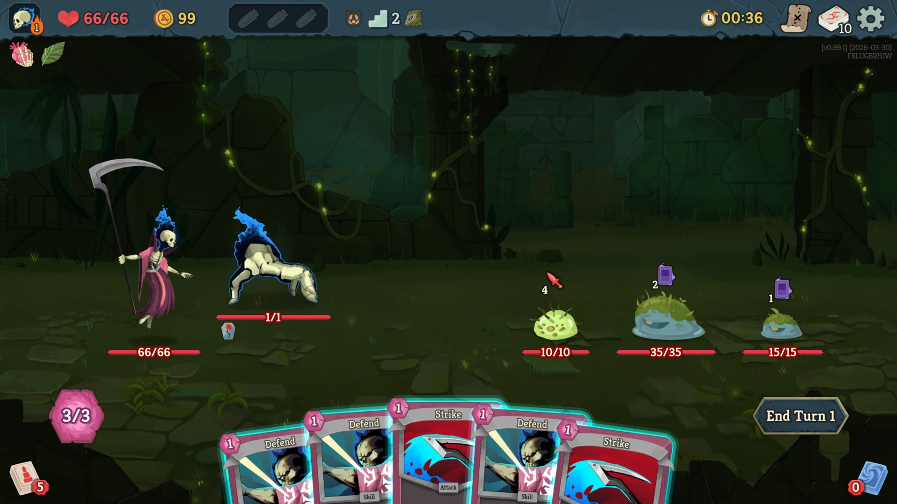

# Spire Slayer

[](https://github.com/czsays/spire-slayer/actions/workflows/ci.yml)

A native macOS companion app for **Slay the Spire 2** that runs alongside the game, displays live game state, and recommends optimal card plays each turn.

Built with [Tauri v2](https://v2.tauri.app/) (Rust backend + React frontend).



## How It Works

Spire Slayer requires the [STS2MCP mod](https://github.com/Gennadiyev/STS2MCP), which exposes a local HTTP API on port 15526 with real-time game state from Slay the Spire 2. The Rust backend polls this API every 500ms, parses the JSON response, and pushes state updates to the React frontend via Tauri events.

During combat, a recommendation engine simulates all valid card play sequences, scores them using fight-context-aware heuristics, and surfaces the top 3 options with reasoning.

## Features

- **Live game state** -- HP, energy, gold, potions, buffs/debuffs, enemy stats, and intents updated in real-time
- **Deck tracker** -- cards grouped by name with pile location (hand, draw, discard, exhaust) and draw odds
- **Combat recommendations** -- ranked card play suggestions with:
  - Smart targeting (debuff cards target survivors; damage cards target efficient kills)
  - HP-preservation-first scoring (blocking prioritized over damage when enemies attack)
  - Setup value scaled by remaining fight length and deck composition
  - Incoming damage/debuff breakdown per option
  - Deduplication of equivalent outcomes
- **Card tooltips** -- hover for computed effects with buff/debuff modifiers
- **Enemy intent parsing** -- attack damage, status cards, buffs, and debuffs from the MCP API
- **Frameless transparent window** -- draggable sidebar with tooltip overflow area
- **Connection status indicator** -- green (live), amber (sample data), red (disconnected)

## Architecture

```
src-tauri/           Rust backend (Tauri v2)
  src/
    api_client.rs    Polls STS2MCP HTTP API, emits Tauri events on state change
    state.rs         Rust types mirroring the MCP API response
    commands.rs      Tauri commands: get_game_state, get_data_source, set_mcp_port
    lib.rs           App setup, plugin registration, background task spawn

src/                 React frontend
  engine/            Combat recommendation engine
    types.ts         SimState, Recommendation, ScoringWeights
    simulator.ts     Card play simulation with smart targeting + backtracking sequence generation
    scorer.ts        Heuristic scoring (lethal, survival, damage, setup with fight-context scaling)
    enemyIntents.ts  MCP intent parsing with fallback damage estimates
    recommend.ts     Top-level API: generates, scores, deduplicates, returns top N
  hooks/
    useGameState.ts  Central hook: subscribes to Tauri events, converts Rust types to frontend types
  contexts/
    GameStateContext  React context distributing live game state to all components
  components/
    DeckTracker.tsx       Main sidebar: card list, pile counts, drag-to-move
    RecommendationPanel   Ranked suggestions with tags, targets, damage/block stats, reasoning
    PlayerStatus.tsx      HP bar, energy with class-specific icon, gold, potions
    EnemyStatusList.tsx   Per-enemy HP bars, block, debuffs, intents
    ConnectionStatus.tsx  Live/sample/disconnected indicator
    EnergyIcon.tsx        Class-based energy icon (ironclad, silent, defect, etc.)
```

## Prerequisites

- **macOS 13+**
- **Rust** (install via [rustup](https://rustup.rs/))
- **Node.js 18+** and npm
- **Slay the Spire 2** with the [STS2MCP mod](https://github.com/Gennadiyev/STS2MCP) installed (provides the HTTP game state API on port 15526)
  - Mod location: `~/Library/Application Support/Steam/steamapps/common/Slay the Spire 2/SlayTheSpire2.app/Contents/MacOS/mods/`

## Development

```bash
# Install dependencies
npm install

# Run in development mode (launches Tauri + Vite dev server)
npm run tauri:dev

# Build for production
npm run tauri:build
```

The dev server runs on `localhost:8080`. The Rust backend connects to the STS2MCP mod at `localhost:15526`.

## Configuration

The window opens as a 400px-wide frameless sidebar (700px total with transparent tooltip overflow). Key settings in `src-tauri/tauri.conf.json`:

| Setting | Value | Notes |
|---------|-------|-------|
| Window size | 700 x 900 | Fixed width, 400px visible sidebar |
| Transparent | Yes | macOS private API for transparent background |
| Decorations | None | Frameless; drag via header area |
| Resizable | No | Transparent windows crash on macOS resize |
| Always on top | No | Configurable in tauri.conf.json |

## Recommendation Engine

The engine runs during combat when cards are in hand:

1. **Sequence generation** -- backtracking algorithm generates all valid card play combinations within energy constraints (capped at 500 sequences)
2. **Simulation** -- each sequence is played out on a mutable copy of the game state, tracking damage, block, debuffs, and targets
3. **Smart targeting** -- debuff cards (e.g. Bash) prefer enemies that will survive the hit so the debuff persists; damage cards prefer the most efficient kill
4. **Scoring** -- heuristic evaluation with priorities:
   - Lethal (kill all enemies) >> kill individual enemies >> block incoming damage >> deal damage >> setup/buffs
   - Unblocked damage is heavily penalized (HP is the most valuable resource)
   - Setup value (Strength, Dexterity, Vulnerable, Weak) scales with estimated remaining fight length and deck composition
   - When enemies buff instead of attacking, the engine doesn't blindly rush damage -- it evaluates whether buffing the player is higher value based on fight context
5. **Deduplication** -- sequences with identical outcomes (same cards + targets, different order) are collapsed into one option

## Tech Stack

- **Tauri v2** -- native macOS app shell with Rust backend
- **React 18** -- UI framework
- **TypeScript** -- frontend language
- **Tailwind CSS** -- styling
- **Vite** -- build tool and dev server
- **Rust** -- backend (reqwest for HTTP, tokio for async, serde for JSON)
- **[STS2MCP](https://github.com/Gennadiyev/STS2MCP)** -- Slay the Spire 2 mod providing the HTTP game state API

## License

[MIT](./LICENSE)
